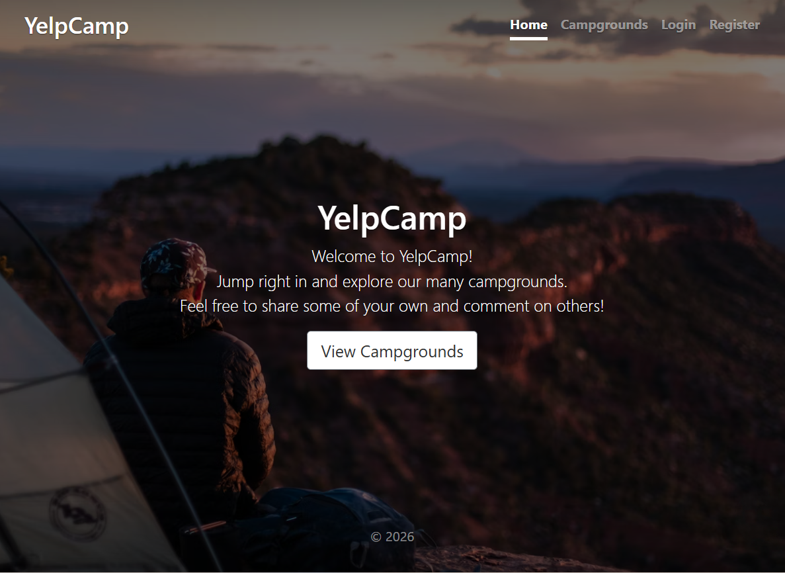
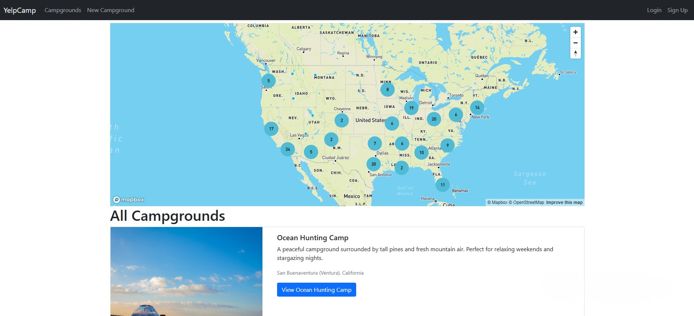
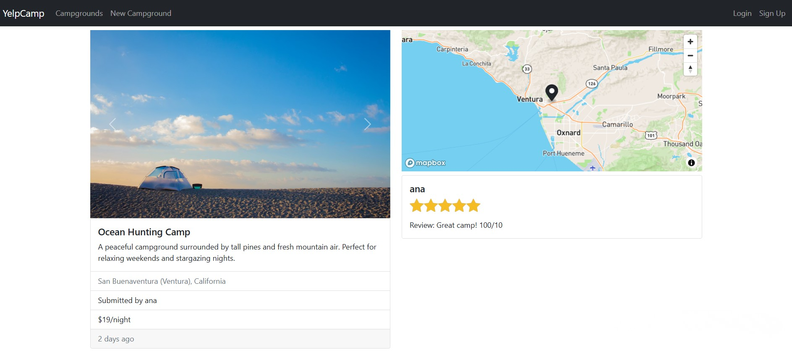
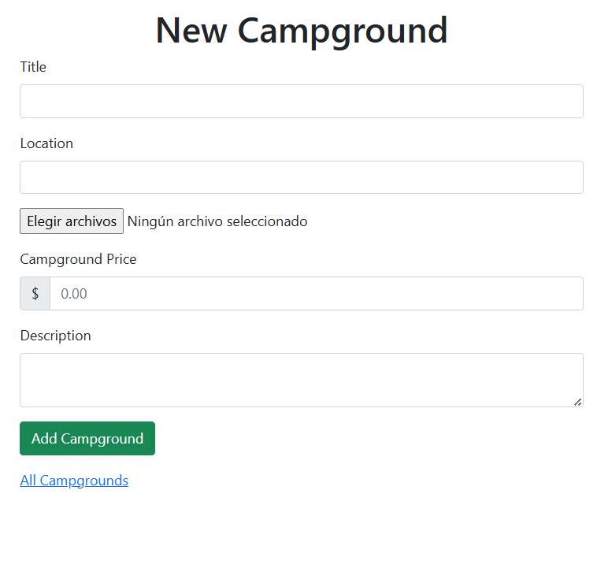
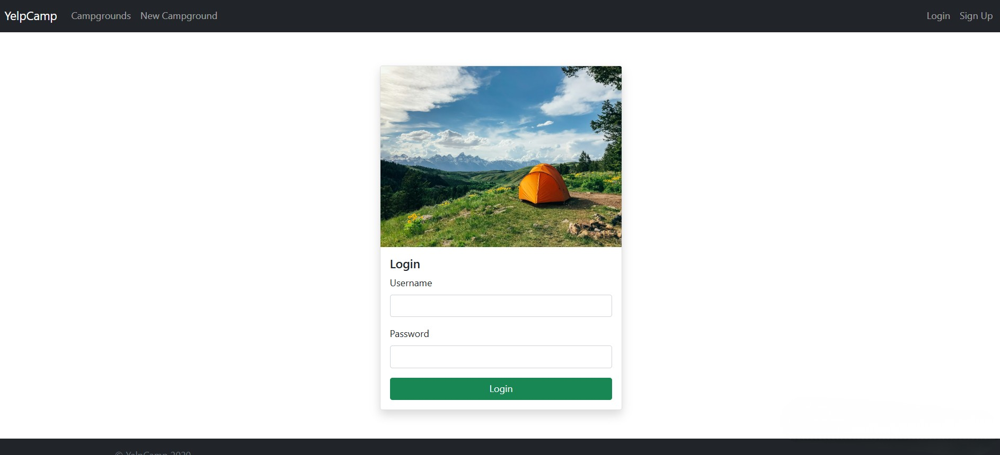

# YelpCamp

> A full-stack campground review platform where users can discover, share and review campgrounds — with interactive maps, image upload and full authentication.

---

## 📸 Screenshots

| Home | All Campgrounds + Map |
|------|-----------------------|
|  |  |

| Campground Details + Reviews | New Campground |
|------------------------------|----------------|
|  |  |

| Login |
|-------|
|  |

---

## ✨ Features

- 🔐 Authentication — sign up, login and logout with session-based auth
- 🏕️ Campground listing — browse all campgrounds with photo, location and price
- 🗺️ Interactive map — clustered map of all campgrounds powered by Mapbox
- 📍 Campground detail — full page with photo carousel, location pin, price and reviews
- ⭐ Review system — authenticated users can leave star ratings and written reviews
- ➕ Create campground — add a new campground with title, location, price, description and images
- 🖼️ Image upload — upload campground photos via Cloudinary
- 🗑️ Delete — owners can delete their own campgrounds and reviews
- ✅ Authorization — only the owner of a campground or review can edit or delete it

---

## 🛠️ Tech Stack


---

## 🚀 Getting Started

### Prerequisites

- Node.js 18+
- MongoDB database (local or Atlas)
- Cloudinary account (for image upload)
- Mapbox account (for maps)

### Installation

```bash
# Clone the repository
git clone https://github.com/nathalliavieira/yelpcamp.git
cd yelpcamp

# Install dependencies
npm install

# Set up environment variables
cp .env.example .env
# Edit .env with your credentials
```

### Environment Variables

```env
DATABASE_URL=your_mongodb_connection_string
SESSION_SECRET=your_session_secret
CLOUDINARY_CLOUD_NAME=your_cloudinary_name
CLOUDINARY_KEY=your_cloudinary_key
CLOUDINARY_SECRET=your_cloudinary_secret
MAPBOX_TOKEN=your_mapbox_token
```

### Seed the database (optional)

```bash
node seeds/index.js
```

### Running locally

```bash
node app.js
```

Open [http://localhost:3000](http://localhost:3000) in your browser.

---

## 🌐 Live Demo

👉 [yelpcamp-bay.vercel.app](https://yelpcamp-bay.vercel.app)
